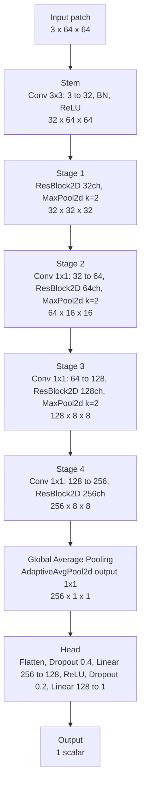

# Malignancy CNN Architecture (Final Run)

Run: `run_20260703_142816`  
Patch size: `64`  
Input channels (2.5D): `3` (axial, coronal, sagittal)  
Base channels: `32`  
Head dropout: `0.4`

## ResBlock2D

Each residual block applies:

1. BatchNorm2d(C)
2. ReLU
3. Conv2d(C, C, 3x3, padding=1)
4. BatchNorm2d(C)
5. ReLU
6. Dropout2d(p=0.1)
7. Conv2d(C, C, 3x3, padding=1)
8. Residual sum with input

## Notes

- The model is trained in regression mode (MSE) to predict malignancy as a continuous value.
- During inference, output can be rounded and clipped to the range 1..5 for ordinal interpretation.